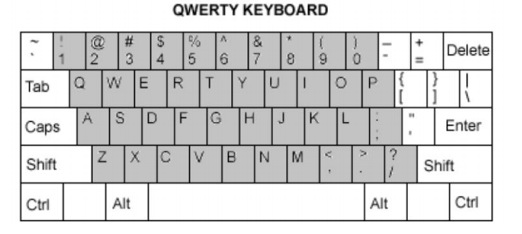
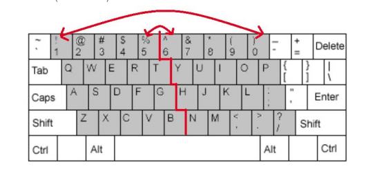
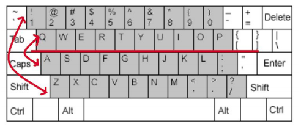

# Overview
The goal of this exercise is to write a stand-alone simple Java
application that performs simple encoding

Part of your application is a set of 3 character transform functions.
These transformations will be applied over a 4 rows x 10 columns section of a
standard QWERTY keyboard as highlighted in the picture above. The four rows start
with 1, q, a, z and extend to 0, p, ;, / respectively.

There are three types of transformations:

# Horizontal Flip (H)
This transformation will flip all rows of the keyboard horizontally.
  
#### Example, doing a single horizontal flip will result in:
  - 1 will swap with 0
  - 2 will swap with 9
  - (and so on)

# Vertical Flip (V)
- This transformation will flip all rows of the keyboard vertically.
#### Example, doing a single vertical flip will result in:
  - 1 will swap with z
  - q will swap with a
  - 2 will swap with x
  - (and so on)

# Shift (#)

- This transformation should take in an integer N and perform a linear shift of the
keyboard. Each key should shift N places to its right if N > 0 (and likewise to the left if
N < 0). If a key would move past its current row then it should shift into the row
below, and so on.
#### For example, for N = 5:
The last five keys(nm,./ would move into the first 5 places of
the top row, the 12345 would move 5 places to the right, 67890 would move to the
start of the 2nd row, and soon). Likewise, left-shifting keys past their current rows
would shift them back into the row above. Therefore, a single right, and a left shift
would produce the same keyboard.

# How to use the application
This application is created solely using Maven. Using Mavens `mvn install` command 
you can install projects into your Maven repository, so it can be used to compile other projects that depend on it.

This app has very little dependencies:
- `junit-jupiter-engine` and `maven-surefire-plugin` for unit tests
- `commons-lang` for some non-trivial Java operations.

The main class within the app is the `Encoder` it accepts the **path** to the text which is going to be encrypted 
and list of **operations** stored in comma-separated text file. To obtain the encoded text 
(based on operations listed in operation file) `getEncodedText()` should be call. 